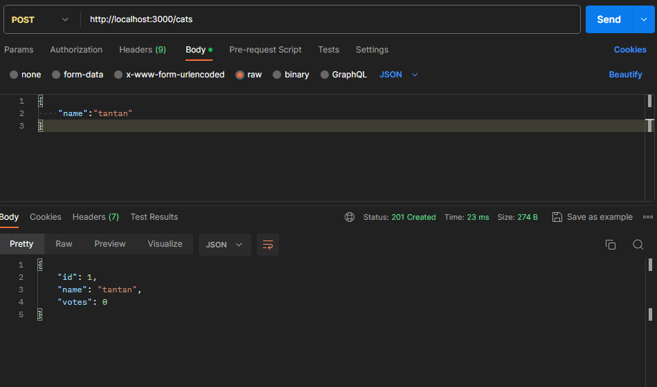
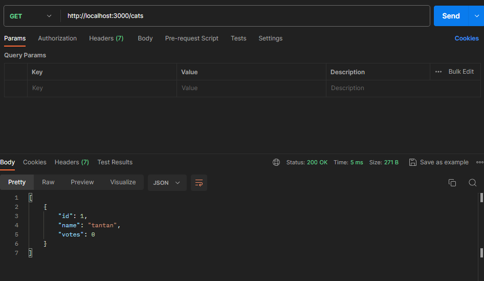
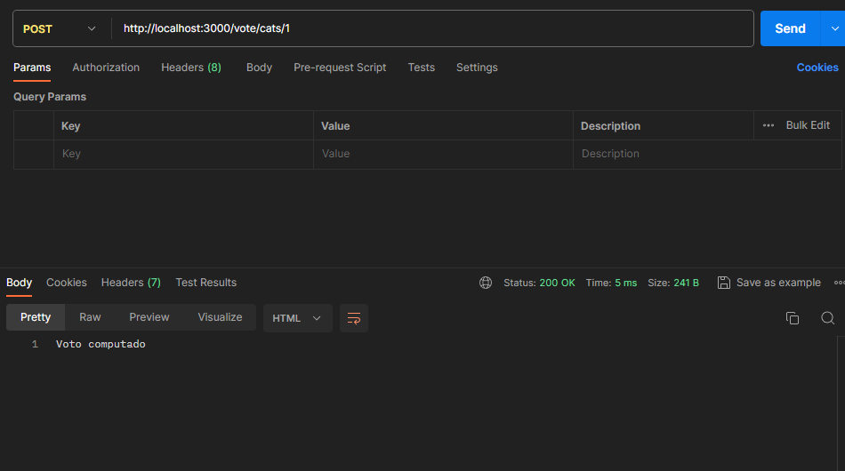
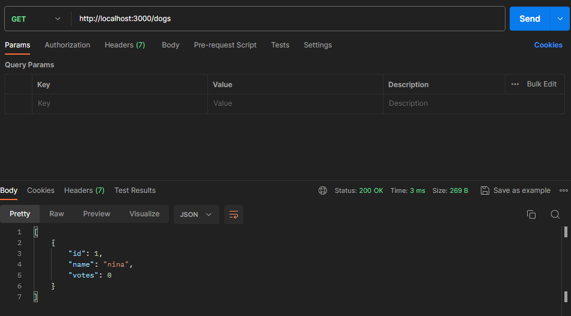
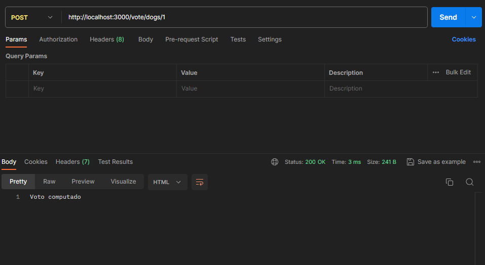

# 20232BSET03P2
Inteli - Engenharia de Software | Avaliação 2023-2B P2

# Vulnerabilidades encontradas

## SQL Injection
Antes, a rota '/vote/:animalType/:id' estava vulnerável a SQL Injection, porque não realizava nenhum filtro de inputs. Agora, ela filtra e recebe apenas os valores 'dogs' e 'cats', além disso, possui uma verificação no ID, que valida se ele é um número ou não. 

## Id autoincrement
Antes, o ID não era colocado corretamente na base de dados. Agora, existe a autoincrementação de IDs na base de dados, e a utilização de chave primária no ID.

## Adição de funções nos endpoints '/dogs' 
As funções GET e POST '/dogs' estavam sem funções, agora elas possuem funções como as rotas '/cats'

## Observações
Nenhum dos erros que podem ocorrer vazam detalhes de implementação. Além disso, foi adicionado tratamento de erros na criação das tabelas.

## Prova de conceito

### Rota /cats
#### Criação de gato

#### Validação de votos

### Rota /dogs
#### Criação de cachorro

#### Validação de votos

